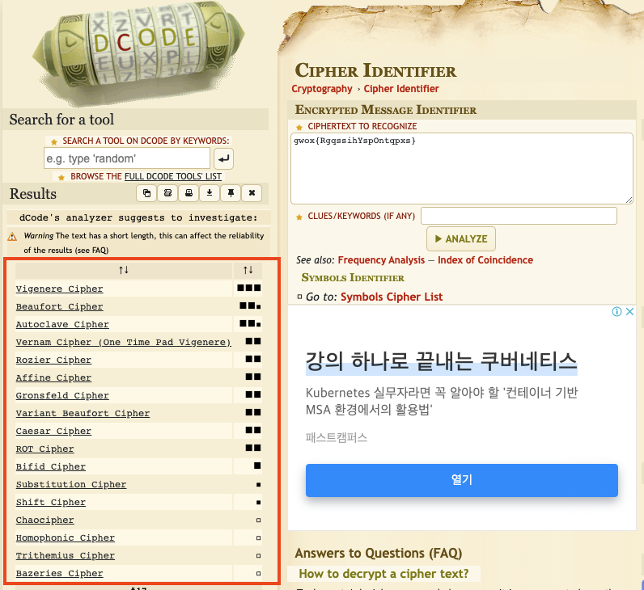

# CTF starter Hidiot

그냥 자꾸 잊어버려서 정리하려고 만든 저장소

Hidiot은 예전에 대회 나갔을 때 팀명

# 1. CTF
### 1) 소개
CTF는 간단히 말해서 **해킹 대회**

- jeopardy - 문제 풀면서 점수를 얻는 방식
- attack defense - 저도 잘 모릅니다.

wargame - 자신의 페이스대로 풀 수 있는 환경, 방식은 CTF와 유사

### 2) 학습 사이트
[드림핵](https://dreamhack.io/)

### 3) 대회
매주 금~일 사이에 대회가 개최되고 [CTF time](https://ctftime.org/)에서 확인할 수 있습니다.

너무 어려운 대회에 참여하면, 성취감을 얻기 힘들기 때문에 차근차근 진행합니다.

### 4) writeup
문제를 어떻게 풀었는 기술하는 작업
, 예시: [0xL4ugh-CTF-writeup](https://velog.io/@skyepodium/0xL4ugh-CTF-writeup)

ctf time의 경우 대회 종료 후 [write up](https://ctftime.org/event/1660/tasks/)에 유저들이 올리기도 하고

구글링, 유튜브 등등 으로 검색가능합니다.

### 5) wargame
좋은 워게임 사이트
- [ctflearn](https://ctflearn.com/)
- [picoCTF](https://picoctf.org/)
- [HackCTF](https://ctf.j0n9hyun.xyz/)
- [ctf-d](http://ctf-d.com/)

### 6) 지난 대회
대부분의 대회 종료 후 서버를 닫고, 문제를 공개하지 않습니다.

일부 대회의 경우 문제와 함께 답을 공개합니다.

- [squareCTF](https://squarectf.com/)   
    square는 미국의 모바일 결제 기업입니다. 매년 CTF 대회를 개최하고, docker로 문제를 제공합니다. 답도 포함되어 있습니다.

# TIPS
사실 이것 때문에 만듬

# 2. crypto
### 1) 암호 알고리즘 판별
어느 알고리즘인지 감이 안잡힐 때 아래 사이트에서 대략적으로 파악할 수 있습니다.

**Vigenere Cipher**로 암호화된 문장을 넣은 경우 예시
[cipher-identifier](https://www.dcode.fr/cipher-identifier)

### 1) 비즈네르 암호(vigenere cypher)
쉬운 문제로 종종 출제
