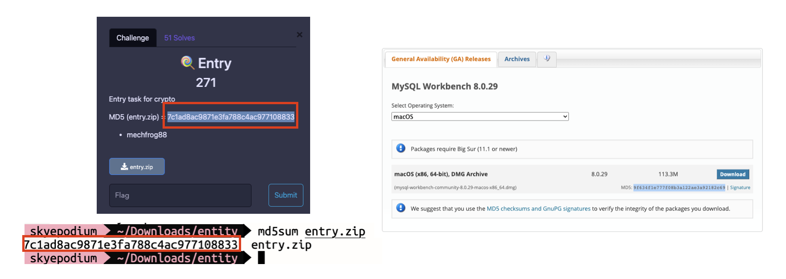

# CTF starter Hidiot

### 1) 소개
**CTF(Capture the Flag)** 는 간단히 말해서 **해킹 대회**

### 2) 학습 사이트
[드림핵](https://dreamhack.io/) - 정말 좋아요

### 3) wargame
wargame은 자신의 페이스로 진행할 수 있는 환경입니다.      

- [picoCTF](https://picoctf.org/)
- [ctflearn](https://ctflearn.com/)
- [ctf-d](http://ctf-d.com/)

### 4) 대회
매주 대회가 개최되며 일정은 [CTF TIME](https://ctftime.org/)에서 확인할 수 있습니다.

대회 난이도가 높으면 성취감을 얻기 힘들기 때문에 낮은 레이팅 부터 시작하거나 워게임 부터 진행합니다.


### 5) writeup
문제를 어떻게 풀었는 기술하는 작업
, 예시: [0xL4ugh-CTF-writeup](https://velog.io/@skyepodium/0xL4ugh-CTF-writeup)

ctf time의 경우 대회 종료 후 [write up](https://ctftime.org/event/1660/tasks/)과 같이 유저들이 올리기도 하고

구글링, 유튜브 등등 으로 검색가능합니다.

### 6) 지난 대회
대부분의 대회 종료 후 서버를 닫고, 문제를 공개하지 않습니다. 일부 대회의 경우 문제와 함께 답을 공개합니다.

- [squareCTF](https://squarectf.com/)   
    square는 미국의 모바일 결제 기업입니다. 매년 CTF 대회를 개최하고, docker로 문제를 제공합니다. 정답도 포함되어 있습니다.

# 1. crypto
### 1) [Cyber chef](https://gchq.github.io/CyberChef/) 🔥🔥🔥
다양한 암호 알고리즘의 디코딩, 인코딩을 온라인으로 지원합니다.

사용법이 간편하고, 문자열 입력값에 따라 가장 유사한 디코딩 알고리즘도 추천해줍니다.

### 2) [암호 알고리즘 판별](https://www.dcode.fr/cipher-identifier) 
어떤 알고리즘인지 감이 안잡히는 경우 대략적으로 파악할 수 있습니다.   
- [[EZCTF] No kidding](https://skyepodium.tistory.com/entry/EZCTF-No-kidding)

### 3) Base64 🔥🔥🔥
기본중의 기본으로 정말 여러가지로 응용해서 나옵니다.
- [base64 repair](https://base64.guru/tools/repair)
- [[ctflearn] Base 2 2 the 6](https://skyepodium.tistory.com/entry/ctflearn-Base-2-2-the-6?category=1029036)
- [[pico CTF] login](https://skyepodium.tistory.com/entry/pico-CTF-login)
- [파이썬 구현](https://velog.io/@skyepodium/base64-%ED%8C%8C%EC%9D%B4%EC%8D%AC-%EA%B5%AC%ED%98%84)

### 4) [ROT13 - caesar cypher](https://gchq.github.io/CyberChef/#recipe=ROT13(true,true,false,13))
쉬운 문제로 종종 출제되거나 다른 문제에 응용됩니다.
- [[pico CTF] caesar](https://skyepodium.tistory.com/entry/pico-CTF-caesar)

### 5) [비즈네르 암호(vigenere cypher)](https://gchq.github.io/CyberChef/#recipe=Vigen%C3%A8re_Decode('blorpy')&input=Z3dveHtSZ3Fzc2loWXNwT250cXB4c30)
문자열과 key를 기반으로 암복호화하는 알고리즘 입니다.     

- [[ctflearn] Vigenere Cipher](https://skyepodium.tistory.com/entry/ctflearn-Vigenere-Cipher?category=1029036)
- [[Vigenere Cipher] 비즈네르 암호 구현](https://velog.io/@skyepodium/Vigenere-Cipher-%EB%B9%84%EC%A6%88%EB%84%A4%EB%A5%B4-%EC%95%94%ED%98%B8-%EA%B5%AC%ED%98%84)

### 6) 진법과 아스키
정말 다양한 방법들이 있습니다, cyber chef를 적극 이용합니다.

- [[ctflearn] Character Encoding](https://skyepodium.tistory.com/entry/ctflearn-Character-Encoding?category=1029036)     
- [[ctflearn] Reverse Polarity](https://skyepodium.tistory.com/entry/ctflearn-Reverse-Polarity?category=1029036)
- [[EZCTF] Qweauty and the Beast](https://skyepodium.tistory.com/entry/EZCTF-Qweauty-and-the-Beast) - 8진법 + 키보드
### 7) [모스부호](https://onlineasciitools.com/convert-morse-to-ascii)
- [[EZCTF] More sense](https://skyepodium.tistory.com/entry/EZCTF-More-sense)
- [[cflearn] Morse Code](https://skyepodium.tistory.com/entry/cflearn-Morse-Code?category=1029036)

### 7) [키보드 레이아웃](https://awsm-tools.com/text/keyboard-layout)
키보드 배열 다르게 해서 암호 문제로 제출됩니다.    
- [[BCACTF 3.0] New Keyboard](https://skyepodium.tistory.com/entry/BCACTF-30-New-Keyboard?category=1028047)

### 8) 특이한 알고리즘
쉬운대회에서는 **crypto** 영역에 정말 특이한 알고리즘을 가져옵니다.
- [Multi-tap Phone](https://skyepodium.tistory.com/entry/EZCTF-No-kidding)
- [줌 아웃](https://skyepodium.tistory.com/entry/EZCTF-OMG)
- [hexahue](https://skyepodium.tistory.com/entry/EZCTF-Too-Many-Colors)

- [postal code](https://skyepodium.tistory.com/entry/Patriot-CTF-No-Postcode-Envy)

# 2. web
### 1) [Wappalyzer](https://chrome.google.com/webstore/detail/wappalyzer-technology-pro/gppongmhjkpfnbhagpmjfkannfbllamg) 🔥🔥🔥
웹이 어떤 프레임워크로 구성되어있는지 확인해주는 크롬 확장 프로그램, 개인적으로 정말 잘쓰고 있어서 추천!!!   


### 2) [크로스 사이트 스크립팅 - xss](https://github.com/skyepodium/ctf-starter-hidiot/blob/main/web/xss.md)
- [BYU CTF 2022 - Social Media](https://skyepodium.tistory.com/entry/BYU-CTF-2022-Social-Media-%ED%81%AC%EB%A1%9C%EC%8A%A4%EC%82%AC%EC%9D%B4%ED%8A%B8-%EC%8A%A4%ED%81%AC%EB%A6%BD%ED%8C%85?category=1028047) - 정석적인 쿠키 탈취 문제

- [[BSidesSF CTF] web-tutorial-1](https://skyepodium.tistory.com/entry/BSidesSF-CTF-web-tutorial-1?category=1028047) - 응용 문제

### 3) Header
- [[pico CTF] Who are you?](https://skyepodium.tistory.com/entry/pico-CTF-Who-are-you)

### 4) file traversal
웹 디렉토리 찾는 문제, 자주 출제됩니다.

[Forbidden Paths](https://skyepodium.tistory.com/entry/pico-CTF-Forbidden-Paths)

### 5) 웹쉘
네트워크로 받은 파라미터를 통해 시스템 콜을 사용하는 취약점입니다.
- [UMassCTF 2021 - Hermit - Part 1](https://velog.io/@skyepodium/UMassCTF-2021-writeup)
- [[Square CTF 2017] Password checker](https://skyepodium.tistory.com/entry/Square-CTF-2017-Password-checker)

### 6) 자바스크립트 재정의
클라이언트 사이드에서 자바스크립트로 필터링 하고 있다면, 다음 문제처럼 그냥 재정의 해버립시다.
- [[SECCON Beginners CTF 2022] Util](https://skyepodium.tistory.com/entry/SECCON-Beginners-CTF-2022-Util)

### 7) 커맨드라인 인젝션
`';'` 세미콜론으로 커맨드 구분해서 나오는 경우가 있습니다.
- [[SECCON Beginners CTF 2022] Util](https://skyepodium.tistory.com/entry/SECCON-Beginners-CTF-2022-Util)

### 8) [자바스크립트 난독화 예쁘게](https://beautifier.io/)
난독화 된것을 원래대로는 못돌리고, 예쁘게 포맷팅해서 분석해야합니다.

[[pico CTF] Client-side-again](https://skyepodium.tistory.com/entry/pico-CTF-Client-side-again)

### 9) 크롬 브라우저 **Search in all files**
웹앱의 모든 리소스에서 문자열을 검색할 때 유용합니다.
- [[pico CTF] Search source](https://skyepodium.tistory.com/entry/pico-CTF-Search-source)
- [[GreyCTF] flappy-js](https://skyepodium.tistory.com/entry/GreyCTF-flappy-js)
### 10) xml
- [[NahamCon_CTF_2022] extravagant](https://skyepodium.tistory.com/entry/NahamConCTF2022-extravagant) - XML external entity attack(xml 외부 엔티티 공격) 문제

### 11) __builtins__
- [[EZCTF] Save peach](https://skyepodium.tistory.com/entry/EZCTF-Save-peach) - 파이썬 시스템 콜

### 11) 특이한 문제
- [PDF - latex](https://skyepodium.tistory.com/entry/SECCON-Beginners-CTF-2022-textex)

### 12) regex-injection
- [[NahamCon_CTF_2022] personnel](https://skyepodium.tistory.com/entry/NahamConCTF2022-personnel)

### 13) 웹 사이트 스캔
숨겨진 페이지를 찾는 문제
- [[Grey Cat The Flag 2022] Too Fast](https://skyepodium.tistory.com/entry/Grey-Cat-The-Flag-2022-Too-Fast)

# 3. php
php는 웹에 분류되지만, 자주 출제됩니다.

### 1) php파일로 인식될 수 있는 확장자
```
php
php3
php4
php5
php7
pht
phtml
phar
```
### 2) [php pregreplace](https://skyepodium.tistory.com/entry/php-pregreplace)
문자열 필터링
### 3) php filter bypass
특정 문자열 필터를 바이 패싱 하는 문제
- [[EZCTF] I made a blog!](https://skyepodium.tistory.com/entry/EZCTF-I-made-a-blog) - base64 사용

### 4) 시스템 콜
- [shell_exec](https://skyepodium.tistory.com/entry/Patriot-CTF-Spongebob)

# 4. SQL Injection
### 1) [cheet sheet](https://github.com/skyepodium/ctf-starter-hidiot/blob/main/sqli/sheet.md)

### 2) 주석 처리
sql 에서 주석 처리는 DB 마다 다르지만 MySql에서는 '--' 으로 할 수 있습니다.

다만, 이는 where 절에서 가능하며
INSERT 구문의 value에서는 불가능합니다.

### 3) 기초
- [[ctflearn] Basic Injection](https://skyepodium.tistory.com/entry/ctflearn-Basic-Injection?category=1029036)
- [[EZCTF] Super Secure](https://skyepodium.tistory.com/entry/EZCTF-Super-Secure)

### 4) blind sql injection 🔥 
브루트 포스와 함께 사용하며, 내가 생각하는 데이터가 맞는지 맞추면서 진행됩니다.
- [SquareCTF 2020 - Deep Web Blog](https://velog.io/@skyepodium/SquareCTF-Writeup)

### 5) union sql injection 🔥
union을 사용하는 방법으로 유용합니다. DB에 따라 필요한 정보가 조금 다릅니다.

- [[BSidesSF CTF] Sequels: A New Bug](https://skyepodium.tistory.com/entry/BSidesSF-CTF-Sequels-A-New-Bug) - mysql
- [[Square CTF 2017] little-doggy-tables](https://skyepodium.tistory.com/entry/Square-CTF-2017-little-doggy-tables) - sqlite

# 5. forensics
### 1) Hex editor 🔥🔥🔥
헥스 에디터는 필수품으로 정말 많은 분야에서 사용됩니다.
- windows - https://mh-nexus.de/en/hxd/
- mac - ihex

- [[pico CTF] information](https://skyepodium.tistory.com/entry/pico-CTF-information)

### 2) [Wireshark](https://www.wireshark.org/) 🔥🔥🔥
와이어 샤크 - 패킷 덤프를 분석하는 프로그램
- [[pico CTF] shark on wire 1](https://skyepodium.tistory.com/entry/pico-CTF-shark-on-wire-1)      
- [[n00bzCTF] tcpdump](https://skyepodium.tistory.com/entry/n00bzCTF-tcpdump) - hex 손실없이 export 하는 방법

필터링 예시
```
frame contains login

http2.header.name=="flag"

frame contains image
```

### 3) fcrack
zip 파일을 여는 프로그램
- [CyberYoddha CTF - Crack the Zip!](https://velog.io/@skyepodium/CyberYoddha-CTF-Writeup#2-crack-the-zip)

### 4) jar
jar 명령어를 통해 손상된 zip 파일을 열 수 있습니다.
```
jar xvf a.zip
```

# 6. stegnography
### 1) [foremost](http://foremost.sourceforge.net/) 🔥
포렌식용 툴인데, 파일 카빙할 때 사용 가능합니다. 개인적으로 제일 좋아합니다.

윈도우에서는 [WSL(Windows Subsystem for Linux)](https://docs.microsoft.com/ko-kr/windows/wsl/install) 에 설치합니다.

```
foremost -t all a.png
```

- [[ctflearn] Binwalk](https://skyepodium.tistory.com/entry/ctflearn-Binwalk?category=1029036)

### 2) [binwalk](https://github.com/ReFirmLabs/binwalk)
이미지에 숨겨진 파일을 추출합니다.   
```
binwalk --extract --dd=".*" a.png
```
- [[pico CTF] Matryoshka doll](https://skyepodium.tistory.com/entry/pico-CTF-Matryoshka-doll)
- [[pico CTF] MacroHard WeakEdge](https://skyepodium.tistory.com/entry/pico-CTF-MacroHard-WeakEdge)

### 3) [zsteg](https://github.com/zed-0xff/zsteg)
이미지에 숨겨진 문자열을 찾아냅니다.

- [[BCACTF 3.0] My New Friend](https://skyepodium.tistory.com/entry/BCACTF-30-My-New-Friend)

### 4) stegsolve
색, 명암을 변경하여 숨겨진 문자열을 찾습니다.
- [[EZCTF] Neo](https://skyepodium.tistory.com/entry/EZCTF-Neo)
- [CyberYoddha CTF - Steg 2](https://velog.io/@skyepodium/CyberYoddha-CTF-Writeup#4-steg-2)
- [syskronCTF - 5. Wednesday](https://velog.io/@skyepodium/syskronCTF-Writeup#5-wednesday)

### 5) exiftool
파일속에 숨겨진 정보를 찾습니다.
- [[ctflearn] WOW…. So Meta](https://skyepodium.tistory.com/entry/ctflearn-WOW%E2%80%A6-So-Meta?category=1029036)
- [[ctflearn] Snowboard](https://skyepodium.tistory.com/entry/ctflearn-Snowboard)

### 6) [스테가노그라피 온라인](https://stylesuxx.github.io/steganography/)
숨겨진 문자열을 찾습니다.
- [[EZCTF] Nobody's perfect](https://skyepodium.tistory.com/entry/EZCTF-Nobodys-perfect)

### 7) [스테그하이드](https://futureboy.us/stegano/decinput.html) 🔥
- [[EZCTF] Bernie](https://skyepodium.tistory.com/entry/EZCTF-Bernie)

### 8) strings
바이너리 파일을 문자열을 추출하는 함수
- [[ctflearn] Forensics 101](https://skyepodium.tistory.com/entry/ctflearn-Forensics-101?category=1029036)

- [[pico CTF] strings it](https://skyepodium.tistory.com/entry/pico-CTF-strings-it)

- [[GreyCTF] Image Upload](https://skyepodium.tistory.com/entry/GreyCTF-Image-Upload)

### 9) [audacity](https://www.audacityteam.org/)
음향 프로그램, 스펙트로그램 이외에도, 음악 뒤집기, 속도 조절등을 수행합니다.
- [[EZCTF] Wavie Wave](https://skyepodium.tistory.com/entry/EZCTF-Wavie-Wave) - 스펙트로 그램

# 7 . reversing
### 1) [기드라](https://ghidra-sre.org/) 🔥🔥🔥
NSA에서만든 C언어 디컴파일러, 영화에 나오는 그 곳 맞습니다.
- 디 어셈블러 - 바이너리 코드의 어셈블리 코드 확인
- 디 컴파일러 - 바이너리 코드로 부터 원래의 코드 확인

리버싱을 하려면 디 컴파일러가 필요합니다. 유명한 도구는 IDA인데 가격이 비싸서, 무료인 기드라를 사용합니다. 

### 2) [jadx-gui](https://velog.io/@skyepodium/%EB%A7%A5-jadx-gui-%EC%84%A4%EC%B9%98)
jar를 디컴파일 하는 경우 jadx-gui를 사용합니다.

### 3) [인텔리제이](https://www.jetbrains.com/ko-kr/idea/download/#section=mac)
.class를 디컴파일 하는데 사용할 수 있습니다.
- [[b01lers CTF] I Love Java](https://skyepodium.tistory.com/entry/b01lers-CTF-I-Love-Java)


# 8. pwnable 🔥🔥🔥
### 1) [pwntools](https://github.com/Gallopsled/pwntools)
exploit 파이썬 라이브러리, 기본으로 사용합니다.

파이썬2 기반이어서 가상환경 구축하고 사용합니다.
```shell
virtualenv pyvenv2 --python=python2.7

source pyvenv2/bin/activate

pip2 install pwntools
```

### 2) 쉘코드
```
// 32bit - 26 바이트
\x31\xc0\x50\x68\x6e\x2f\x73\x68\x68\x2f\x2f\x62\x69\x89\xe3\x31\xc9\x31\xd2\xb0\x08\x40\x40\x40\xcd\x80'
```
### 3) 코드 분석
- [CyberYoddha CTF - Password 1](https://velog.io/@skyepodium/CyberYoddha-CTF-Writeup#1-password-1)


### 3) Buffer over flow
포너블의 시작, 버퍼 오버 플로우에서 시작합니다. 정말 중요
- [0xL4ugh CTF - Leak](https://velog.io/@skyepodium/0xL4ugh-CTF-writeup#3-leak)
- [meta CTF - Baffling Buffer 0](https://velog.io/@skyepodium/Meta-CTF-Writeup#1-baffling-buffer-0)
- [meta CTF - Baffling Buffer 1](https://velog.io/@skyepodium/Meta-CTF-Writeup#2-baffling-buffer-1)

### 4) format string
포맷 스트링 공격 몇번 해보면 감이 옵니다.
- [0xL4ugh CTF - Trigger Happy](https://velog.io/@skyepodium/0xL4ugh-CTF-writeup#2-trigger-happy)

# 9. programming
보안과는 관련없이 프로그래밍을 하는 문제가 있습니다. 파이썬을 사용하면 정말 유리합니다.
- [[pwnable.kr] coin1](https://velog.io/@skyepodium/pwnable-coin1)
- [[HSCTF 9] travelling-salesman](https://skyepodium.tistory.com/entry/HSCTF-9-travelling-salesman)
- [[HSCTF 9] vending-machine](https://skyepodium.tistory.com/entry/HSCTF-9-vending-machine)

# 10. 기타
### 1) robots.txt
robots.txt는 웹 크롤러가 해당 경로에 접근하지 말라는 의미로 domain/robots.txt에 지정합니다.

robot 어쩌구 저쩌구 나오면 힌트가 있을 확률이 높고, 그것이 아니더라도 여러 CTF 대회에서 먼저 확인하는 부분중 하나 입니다.
- [[ctflearn] Where Can My Robot Go?](https://skyepodium.tistory.com/entry/ctflearn-Where-Can-My-Robot-Go?category=1029036)
- [pico CTF - where are the robots](https://play.picoctf.org/practice?category=1&page=1&search=where%20are%20the%20robots)

### 2) [매직 해시](https://github.com/skyepodium/ctf-starter-hidiot/blob/main/hash/magic-hash.md)
불리언 문맥에서 0으로 평가받을 수 있는 해시들의 모음입니다.

### 3) [정규 표현식](https://velog.io/@skyepodium/%EC%A0%95%EA%B7%9C%ED%91%9C%ED%98%84%EC%8B%9D-%EC%95%8C%EC%95%84%EB%B3%B4%EA%B8%B0)
- [[NahamCon_CTF_2022] personnel](https://skyepodium.tistory.com/entry/NahamConCTF2022-personnel)

# 11. 팁
### 1) | 파이프라인
다음과 같이 쓰는 경우가 많습니다. `|` 파이프라인은 앞의 결과를 뒤 함수의 인풋으로 넣습니다.
```
cat flag.txt | grep flag{
```
### 2) grep
grep 은 특정 내용이 포함된 문자열을 필터링 하는 함수입니다.
```
cat flag.txt | grep flag{
```
### 3) 맥북 아이피 확인
```
ifconfig | grep inet
```

### 4) ls -al
숨겨진 파일을 찾습니다.
[[ctflearn] Taking LS](https://skyepodium.tistory.com/entry/ctflearn-Taking-LS?category=1029036)

### 5) https 서버
만약 사이트가 https 프로토콜을 사용하고, 로컬의 서버가 http이면 전송이 불가능합니다.(https -> http 요청 불가)

따라서, https 서버가 필요하면 [post bin](https://www.toptal.com/developers/postbin/), [request bin](https://requestbin.com/)을 사용할 수 있습니다. 사용법은 간단합니다.

### 6) Discord
flag 준다고 Discord 들어오라는 경우가 있습니다.

막상 들어가도 어디있는지 못찾는 경우가 있는데, 대부분 사진처럼 최상단에 있습니다.


### 7) writeup 🔥🔥🔥
wirteup은 어떻게 문제를 풀었는지 기술하는 과정입니다.

대회가 끝나면 [CTF TIME](https://ctftime.org/event/1660/tasks/) 에 업로드 되기도 하고 googling, youtube로 검색됩니다.


개인적으로 한문제 풀때마다 블로그에 비공개로 writeup 작성하는게 좋은것 같습니다. 정말로, 문제 풀고, 대회 끝나면 잘 기억 안납니다.

나중에 비슷한 문제 만나도 접근하기 힘들어지고 아쉬움만 남습니다.

그래서 그냥 블로그에 비공개로 막쓰는것 추천, 네이버, 티스토리 이런곳에 편하게
개인적으로 깃허브 프라이빗에 써봤는데 이미지 넣는것이 힘들어서 비추

### 8) MD5 Hash
사진 처럼 다운로드 파일에 MD5 Hash를 함께 적어주는 경우가 있습니다.

이것은 해당 파일이 위조되지 않았음을 보장하기 위해 MD5 Hash를 적어줍니다.

우측은 [MySQL workbench](https://dev.mysql.com/downloads/workbench/) 의 사례입니다.



그리고, CTF에서 조금 특별한 의미를 가지는데 [virus total](https://www.virustotal.com/gui/home/upload) 에서 MD5 해시를 통해서 파일이 등록된 바이러스인지 여부를 알려줍니다.

예전에 참가했던 대회에서 관련 문제가 있었는데 기록해 놓지 않아서, 예제가 없습니다. 혹시라도 다음에 만나게 된다면, 적어놓을께요


# 12. 리눅스
### 1) 현재 디렉토리에서 문자열 찾기
```
grep -rn "flag"
```
- [[HSCTF 9] the-great-directory-egg-hunt](https://skyepodium.tistory.com/entry/HSCTF-9-the-great-directory-egg-hunt)

### 2) file
파일의 유형을 알려줍니다.

file은 매직 해시를 보고 판단하기 때문에 확장자가 잘못 작성된 경우에 원래의 파일을 추측하는데 사용할 수 있습니다.
```
file 1.png

1.txt: ASCII text
```


### 3) base64
```
echo SGVsbG8gV29ybGQ= | base64 -d

Hello World
```

### 4) md5 해시 생성
```
md5sum 1.txt
```

### 5) 현재 디렉토리 파일의 개수
```
ls -l | grep ^- | wc -l
```

### 6) 현재 디렉토리 디렉토리의 개수
```
ls -l | grep ^d | wc -l​
```

### 7) tac
파일 거꾸로 읽기, cat의 반대버전
```
tac a.txt
```

### 8) 디렉토리 알파벳 역순 - reverse
```
ls -r
```

# 13. curl
### 1) 기본 사용법
```
curl -X GET https://www.google.com
```

### 2) 요청 결과 파일로 만들기
```
curl -X GET https://www.google.com --output - > 1.txt
```

### 3) 헤더 추가
http range request 예시
```
curl -X GET -H 'Range: bytes=0-10239' https://www.google.com

curl -r 0-10230 https://www.google.com
```

# 14. cat
### 1) 기본 사용
조회
```
cat 1.txt
```

### 2) 파일 합치기
바이너리 순서로 합칩니다.
```
cat 1.txt 2.txt -> 3.txt
```

# 15. 자바스크립트
### 1) 부동 소수점
JS의 모든 숫자는 부동 소수점을 사용하며, 안전한 계산 범위는 `-(2^53 - 1)` ~ `2^53 -1` 입니다.

이 범위를 넘어가는 모든 숫자는 홀수, 짝수 관계없이 2의 배수로 표현됩니다. 
- [[Square CTF 2021] Huge Primes](https://skyepodium.tistory.com/entry/Square-CTF-2021-Huge-Primes)

### 2) 유니코드 - 한글필터 백도어
[한글필터](https://www.compart.com/en/unicode/U+3164)는 유니코드이며 이를 통해 눈에 안보이는 백도어를 만든 문제입니다.
- [Square CTF 2021 - Korean Space Program (feat: 투명 백도어)](https://velog.io/@skyepodium/Square-CTF-2021-Korean-Space-Program-feat-%ED%88%AC%EB%AA%85-%EB%B0%B1%EB%8F%84%EC%96%B4)